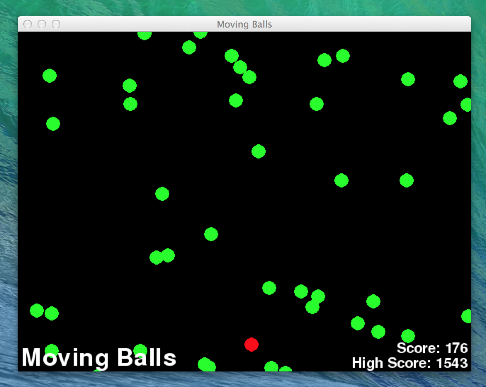

#Ball
A simple animation test written in python using the pygame library. Use the arrow keys to move the red ball to avoid the green balls as they move down the screen. 

##Requirements
Requires the pygame library which can be downloaded [here](http://www.pygame.org/ "PyGame").

##Screen Shot

